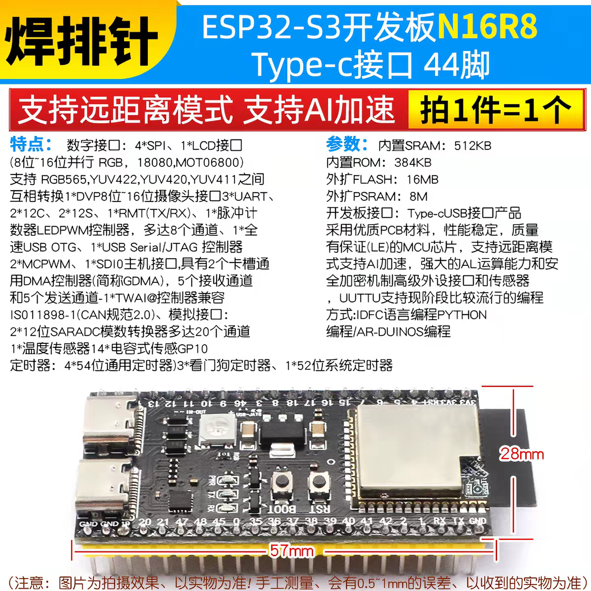

<!-- markdownlint-disable -->

# ESP32-S3 开发板 N16R8（Type-C，44 脚）

淘宝商品页信息整理，库存板。

## 核心参数

- 主控：ESP32-S3（支持远距离模式、AI 加速向量指令）
- 内置 SRAM 512KB、ROM 384KB
- **外扩 FLASH 16MB、外扩 PSRAM 8MB（OCT）**
- USB：Type-C；1×全速 USB OTG + 1×USB Serial/JTAG 控制器（可直接 USB 烧录/调试，无需串口芯片）
- 尺寸：57mm × 28mm，44 脚，排针需自焊（"焊排针"款）

## 数字接口

- 4×SPI、1×LCD 并行接口（8~16 位并行 RGB，8080/Motorola6800 总线；支持 RGB565/YUV422/YUV420/YUV411 互转）
- **1×DVP 8~16 位摄像头接口**（芯片能力，经 GPIO 引出；板上无专用摄像头排线座）
- 3×UART、2×I2C、2×I2S、1×RMT(TX/RX)、1×脉冲计数器
- LED PWM 控制器（8 通道）、2×MCPWM
- 1×SDIO 主机接口（支持 2 个卡槽）
- GDMA 通用 DMA 控制器（5 收 5 发通道）
- 1×TWAI 控制器（兼容 ISO11898-1 / CAN 2.0）

## 模拟与其他

- 2×12 位 SAR ADC（多达 20 通道）
- 1×内部温度传感器、14×电容式触摸 GPIO
- 定时器：4×54 位通用定时器、3×看门狗、1×52 位系统定时器

## 编程方式

ESP-IDF（C）、MicroPython、Arduino 均支持

## 项目相关备注（home-monitor #12 摄像头）

- PSRAM 8MB + DVP 摄像头接口：**满足视频流采集的硬件前提**（无 PSRAM 跑不动摄像头帧缓冲）
- 但板上**无摄像头排线座**，接 OV2640 需杜邦线/飞线连 DVP GPIO，高速并行信号飞线易花屏；备选是另购带排线座的一体板
- 排针未焊，使用前需先焊

## info images

- 
