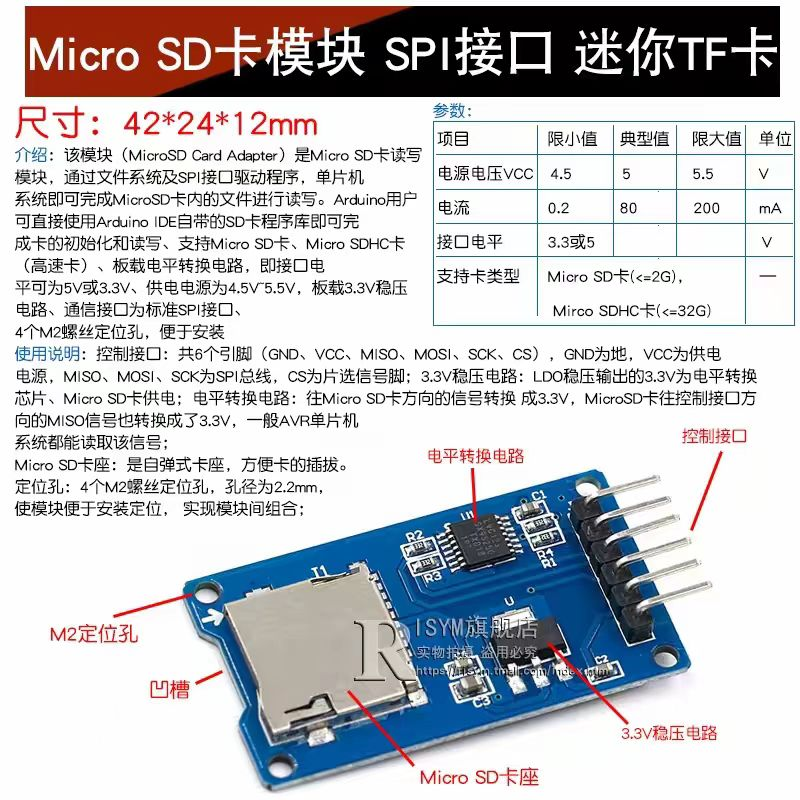
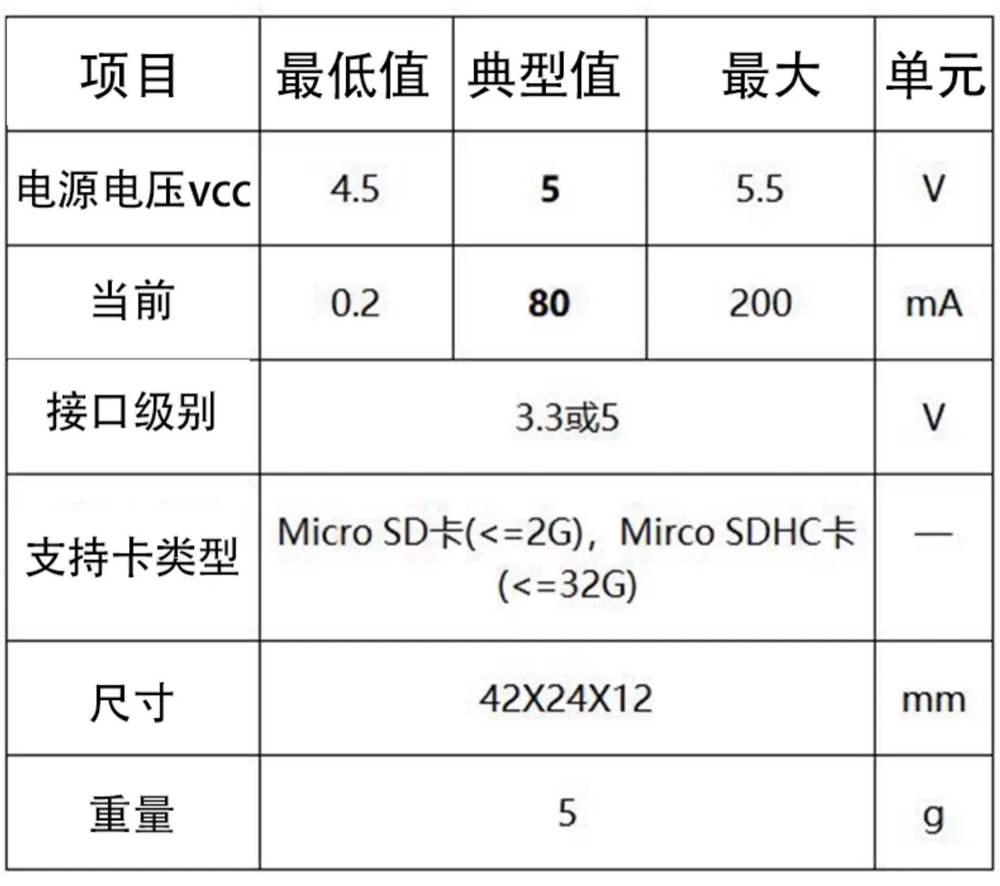
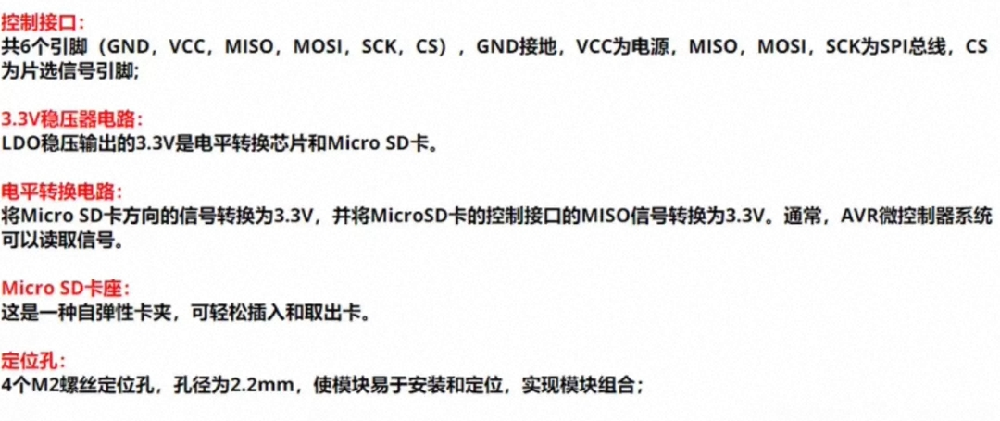
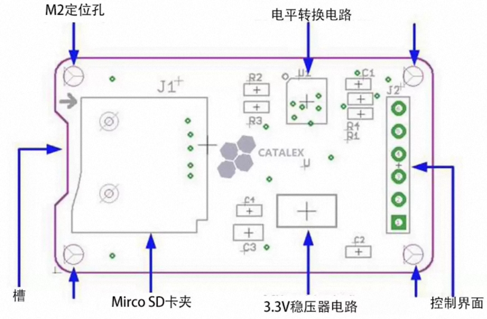
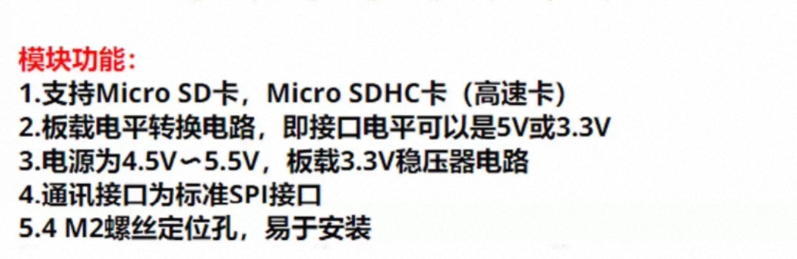
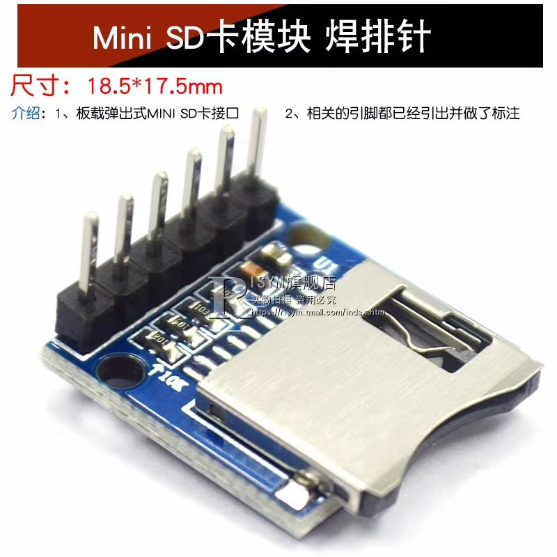
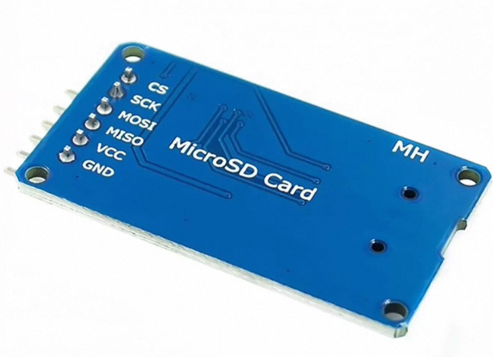

<!-- markdownlint-disable -->

# MicroSD SPI 卡模块（CATALEX MicroSD Card Adapter v0.9b）

SPI 接口 MicroSD 卡读写模块，板载 74VHC125 电平转换 + 3.3V LDO，面向 5V/3.3V 单片机通用。本文档面向后续 ESP32-S3 摄像头本地录像开发查阅，事实以原理图 `MicroSD Card Adapter v0.9b原理图.pdf` 为准，商品页与用户文档作补充。

> ⚠️ **版本警示**：本目录除 product-photo-1.jpg 外，全部资料（原理图、用户文档、desc-1~5）对应的是**带电平转换的大板款**（42×24mm，CATALEX v0.9b）；product-photo-1.jpg 是另一款**无电平转换的迷你裸板款**（18.5×17.5mm，无资料）。两者不是同一块板，接线规则不同（见"两版差异"节），**以实际购买到的实物为准**。

## 模块身份与来源

- 型号：**CATALEX MicroSD Card Adapter v0.9b**（2013.07，Design: Fred.Chu，淘宝 CATALEX/ISYM 等店铺通用公版）
- 电平转换芯片：**74VHC125**（四路缓冲器，数据手册 `74VHC125MTC数据手册.pdf`）
- 用户文档：`MicroSD Card Adapter用户文档.pdf`（7 页，内容以 Arduino 接线演示为主，技术价值低，关键信息以原理图为准）

## 模块参数（大板款）

来源：用户文档 / 商品页（desc-1/desc-2）。

| 项目 | 参数 |
| --- | --- |
| 通信接口 | 标准 SPI（MISO/MOSI/SCK/CS） |
| 电源电压 VCC | **4.5~5.5V**（典型 5V；板载 LDO 降压到 3.3V 供卡与缓冲器） |
| 接口电平 | 3.3V 或 5V 均可（电平转换后对外输出为 3.3V） |
| 电流 | 0.2 / 80 / 200 mA（最小/典型/最大） |
| 支持卡类型 | Micro SD（≤2G）、Micro SDHC（≤32G，FAT32）——此为 Arduino SD 库限制；硬件上更大卡格式化成 FAT32 亦可用 |
| 卡座 | 自弹式（push-push） |
| 尺寸 / 重量 | 42×24×12mm / 5g，4 个 M2 定位孔（孔径 2.2mm） |

## 排针引脚（J2，6 脚）

原理图 J2 引脚序：**1=GND, 2=VCC, 3=MISO, 4=MOSI, 5=SCK, 6=CS**（板背丝印顺序 GND VCC MISO MOSI SCK CS，见 product-photo-2.jpg）。

## 电路结构要点（原理图）

- **电源**：VCC(5V) → LDO（U，C2/C3/C4 滤波）→ 3V3，供卡座 VDD 与 74VHC125。因此 **VCC 不能接 3.3V**（LDO 压差不工作，规格下限 4.5V）。
- **信号方向（主控→卡）**：CS / MOSI / SCK 各串 **3.3K**（R1/R2/R3）进 74VHC125 的 A 端，Y 端输出到卡——缓冲器以 3.3V 供电，故 5V 或 3.3V 输入信号都转成 3.3V 给卡（74VHC 输入 5V 容忍）。
- **信号方向（卡→主控）**：卡 DO → R4(3.3K) → U1D A 端 → Y 端输出 MISO，**对外是 3.3V 电平**——接 ESP32-S3 GPIO 无需再转换。
- 卡座 J1 有 CDN（卡检测）触点但**未引到排针**，检测插卡只能靠 SPI 初始化成败。

## ESP32-S3 接线结论

- VCC → 开发板 **5V** 脚，GND → GND，SPI 四线直连任意可用 GPIO（3.3V 电平，双方兼容）。
- 供电预算：写卡峰值按 200mA 留余量，注意 5V 轨带载能力。
- 电流典型 80mA 主要来自 SD 卡本身，与模块无关；SPI 模式实测速度约 1~2MB/s，存 JPEG 照片/短 MJPEG 片段够用，高清流畅录像需 SDMMC 方案（见 ov2640 文档与 #12 讨论）。

## 两版差异（大板款 vs 迷你裸板款）

| | 大板款（本目录资料） | 迷你裸板款（仅 product-photo-1.jpg） |
| --- | --- | --- |
| 电平转换 | 74VHC125 + LDO | 无（仅上拉电阻） |
| VCC | 必须 5V（4.5~5.5V） | 只能 3.3V |
| 接口电平 | 对外 3.3V，输入容忍 5V | 3.3V 直连 |
| 尺寸 | 42×24mm，带 M2 定位孔 | 18.5×17.5mm |
| 对 ESP32-S3 | 需拉一根 5V 线 | 最简，全 3.3V |

迷你款无官方资料，引脚以实物丝印为准（同类公版为 GND VCC MISO MOSI SCK CS 或 GND 3V3 序，到手用万用表确认）。

## info images

- 
- 
- 
- 
- 
- 
- 
