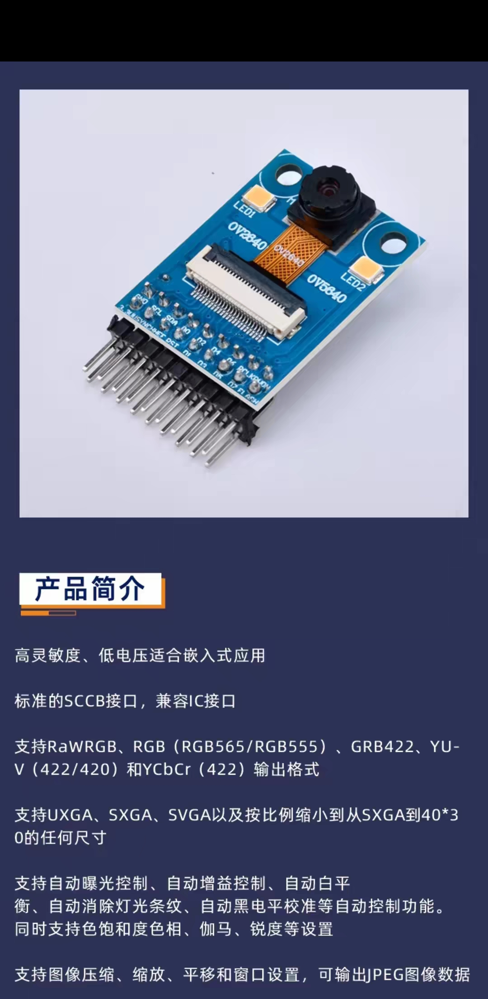
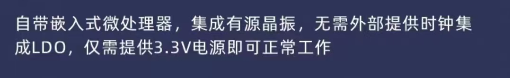
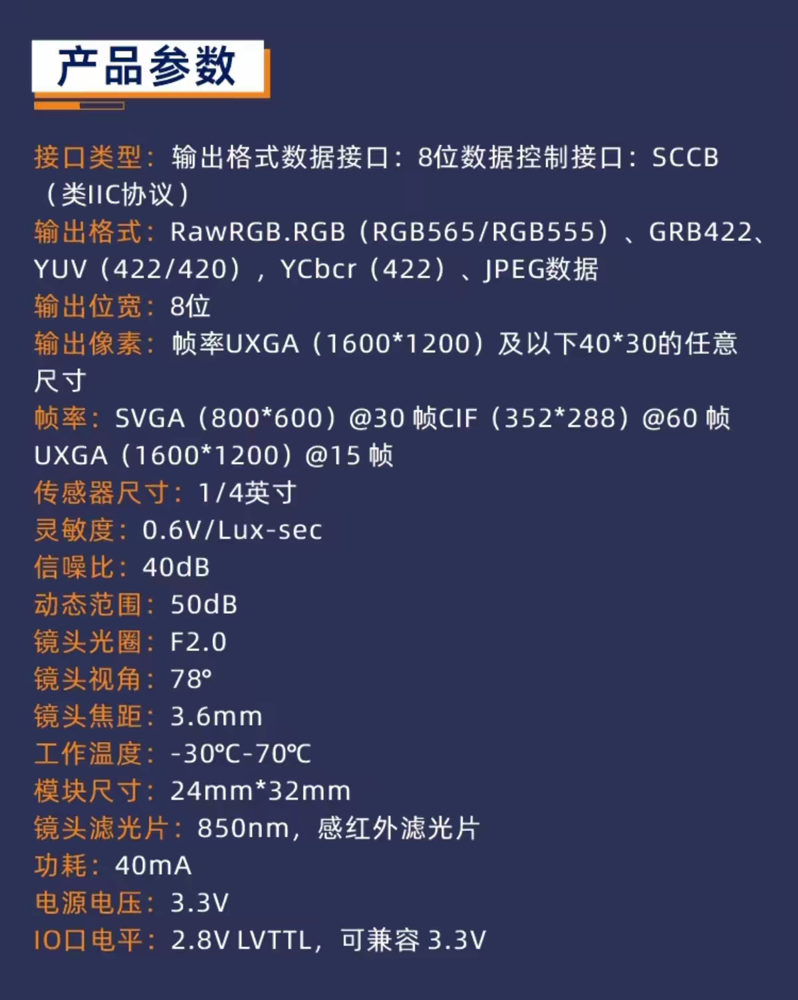
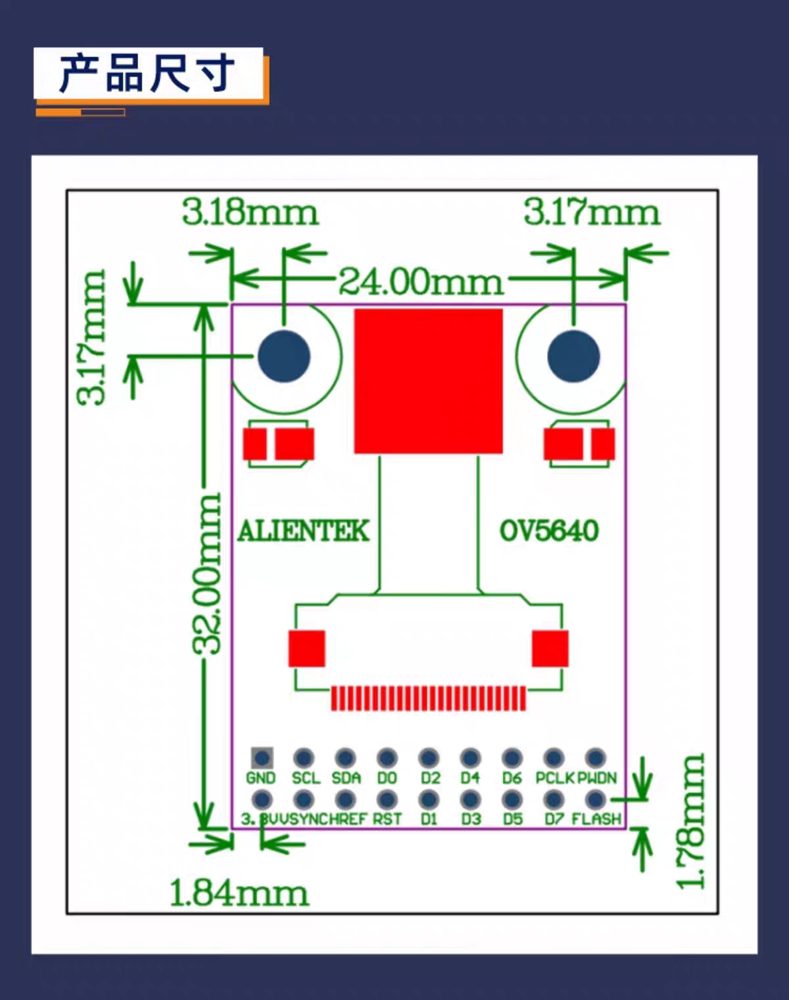
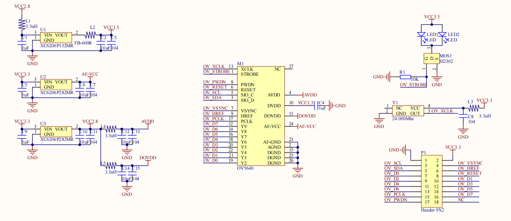

<!-- markdownlint-disable -->

# OV2640 摄像头模组（正点原子 ATK-MC2640，排针款）

200 万像素 OV2640 无 FIFO 直出 DVP 模组，2×9 2.54mm 排针，可杜邦线直连 ESP32-S3 N16R8 开发板（无摄像头排线座）跑 esp32-camera 固件。本文档面向后续 ESP32-S3 开发查阅，事实以正点原子官方手册/原理图为准，淘宝商品页信息仅作补充。

## 模块身份与来源

- 型号：**ATK-MC2640**（正点原子，PCB 与 OV5640 版本 ATK-MC5640 共用）
- 传感器：OmniVision OV2640，1/4 英寸 CMOS UXGA（1632×1232）
- 官方资料页：<http://www.openedv.com/docs/modules/camera/ov2640.html>

### 资料包内容索引（`【正点原子】OV2640摄像头模块资料（新版本）/`）

| 内容 | 路径 |
| --- | --- |
| 模块使用说明 V1.2（STM32 接线表 + GPIO/DCMI/JPEG 例程源码解读） | `ATK-MC2640模块使用说明_V1.2.pdf` |
| 模块用户手册 V1.1（特性/电气参数、引脚定义、SCCB、输出时序、结构尺寸） | `ATK-MC2640模块用户手册_V1.1.pdf` |
| 原理图 ATK-OV2640 V2.2（PDF + 封装库 zip） | `1，原理图/ATK-OV2640 V2.2.pdf`、`ATK-MC2640_Lib.zip`；本目录另有截图 `schematic-diagram.png` |
| STM32 例程源码（GPIO / DCMI / JPEG 三种采集方式，F103/F407/F429/F767/H743/H750） | `2，程序源码/`（zip，未解压） |
| 上位机软件 ATK-XCAM V1.3（JPEG 例程配套，串口接收显示） | `3，软件资料/ATK-XCAM V1.3.exe` |
| OV2640 官方数据手册 DS(1.6)、硬件应用笔记 1.04、软件应用笔记 1.03、SCCB 规范 | `4，参考资料/`（4 份 PDF） |
| 传感器裸模组（FPC 款）机械尺寸图 | 本目录 `mechanical-dimension-drawing.pdf`（注意：是 FPC 排线版裸模组的图，**不是**本排针模块的板框图） |

## 模块参数

来源：用户手册 §1 表 1.1/1.2，与淘宝商品页一致。

| 项目 | 参数 |
| --- | --- |
| 控制接口 | SCCB（兼容 IIC），SIO_C/SIO_D 两线 |
| 数据接口 | DVP 8 位并行（D0~D7 + PCLK + HREF + VSYNC），**无 FIFO 直出** |
| 输出格式 | RawRGB、RGB565、RGB555、GRB422、YUV422、YUV420、YCbCr422、**JPEG（片上压缩）** |
| 分辨率 | UXGA(1600×1200) 及以下，可按比例缩到最小 40×30 |
| 最大帧率 | UXGA 15fps / SVGA(800×600) 30fps / CIF(352×288) 60fps |
| 镜头 | F2.0、视角 78°、焦距 3.6mm |
| 滤光片 | **850nm 感红外滤光片（IR-pass，滤可见光）**——夜视用途 |
| 灵敏度 / 信噪比 / 动态范围 | 0.6V/Lux-sec / 40dB / 50dB |
| 工作电压 | 3.3V（板载 LDO，无需其他电源轨） |
| IO 电平 | 2.8V，兼容 3.3V（手册注：3.3V MCU 直连；5V MCU 信号线串 1K 限流） |
| 功耗 | 40mA |
| 尺寸 / 工作温度 | 24×32mm / -30~70℃ |

自动控制：AEC/AGC/AWB、自动消灯光条纹、自动黑电平校准；支持饱和度、色相、伽马、锐度、缩放、平移、窗口设置（手册 §1）。

## 排针引脚定义（2×9，2.54mm）

排针丝印顺序（用户手册图 3.1 尺寸图与淘宝尺寸图一致）：

```text
上排：GND  SCL  SDA  D0  D2  D4  D6  PCLK  PWDN
下排：3V3  VSYNC HREF RST D1  D3  D5  D7    FLASH
```

各脚功能（用户手册 §2.1 表 2.1.1）与 ESP32-S3 接线建议：

| 引脚 | 功能 | ESP32-S3 是否必须接 |
| --- | --- | --- |
| 3.3V | 3.3V 电源输入 | 必须 |
| GND | 电源地 | 必须 |
| SCL | SCCB 时钟（SIO_C） | 必须（寄存器配置） |
| SDA | SCCB 数据（SIO_D） | 必须 |
| D0~D7 | 8 位并行数据输出 | 必须 |
| PCLK | 像素时钟输出，**可达 36MHz**；数据在 PCLK 下降沿更新，主控须在**上升沿**读取 | 必须 |
| HREF | 行同步输出，高电平期间数据有效（模块未引出 HSYNC，用 HREF 同步即可） | 必须 |
| VSYNC | 帧同步输出，每个脉冲表示新帧开始 | 必须 |
| RST | 复位，**低电平有效** | 建议接（也可固定拉高，但失去硬复位能力） |
| PWDN | 掉电使能，**高电平有效** | 可接 GPIO 或直接接地（常开） |
| FLASH | 外部控制闪光灯信号，**高电平有效** | 见下节"LED 补光控制" |

注意：引脚定义里**没有 XCLK**——模块自带 24MHz 有源晶振直供 OV2640 XCLK（用户手册 §2.1），主控无需输出主时钟，这是与常见裸 OV2640 模组接线最大的差别。

## 电气与接线要点

- 单 3.3V 供电即可：板载 3 颗 XC6206 LDO 分别产生核压（VCC1.5）、VCC2.8（AVDD/DOVDD）与 AF-VCC（原理图 Y1/U2~U4；手册 §2.1 描述为提供 2.8V 与 1.3V，以原理图为准）。
- IO 电平 2.8V LVTTL，3.3V 系统直连无需电平转换（手册表 1.2 注 1）。
- 初始化顺序（使用说明 §2.1.2，驱动 `atk_mc2640_init()`）：退出掉电（PWDN 拉低）→ 硬复位（RST 拉低再释放）→ SCCB 初始化 → 软复位 → 读 MID/PID 校验 → 写初始化寄存器表。esp32-camera 的探测流程同构。
- SCCB 从机地址：**写 0x60 / 读 0x61**（OV2640_DS(1.6).pdf §Device Control，Table 12 前文）。寄存器分两个 bank，由 0xFF 选择（0xFF=00 传感器 bank / 0xFF=01 DSP bank）。
- 时序要点（用户手册 §2.3/§2.4）：
  - HREF 高电平期间每个 PCLK 输出 1 字节；RGB/YUV 格式 1 像素 = 2 个 PCLK（RGB565 低字节在前），RawRGB 1 像素 = 1 个 PCLK。
  - **JPEG 输出时 HREF 不连续**（一行中可能多次拉低），判 HREF 高读数即可；JPEG 流无高低字节概念，从头存到尾即一帧。
  - PCLK 最高 36MHz，主控采样不够快时可用寄存器 0xD3、0x11 分频降 PCLK（代价是帧率下降）。

## LED 补光控制（版本差异，重要）

- 板载两颗白光 LED（LED1/LED2），由 SI2302 MOS 驱动（原理图）。
- 用户手册 §2.1：闪光灯可**由 OV2640 的 STROBE 脚控制（可编程）或外部引脚（FLASH）控制，通过焊接 R2 或 R3 切换**，二选一。
- **版本差异警示**：原理图 ATK-OV2640 V2.2 的 Header 9×2 第 18 脚为 **NC**（无 FLASH 脚，LED 默认走 OV_STROBE），而淘宝尺寸图/用户手册丝印含 FLASH 脚。两版丝印/原理图不一致，**以实物为准**：到手后用万用表确认 18 脚是否连通 LED 驱动网络，再决定用 GPIO 控 FLASH 还是用 SCCB 配 STROBE。
- 本模块是 **850nm IR-pass 滤光片**：白光 LED 发出的可见光大部分被滤掉，补光基本无效；夜视应外接 850nm 红外补光灯板，LED 控制仅作参考。

## ESP32-S3 开发提示

- **片上 JPEG 输出**：OV2640 支持图像压缩直接输出 JPEG（手册 §1 "支持图像压缩，即可输出 JPEG 图像数据"；使用说明 §2.3 有完整 JPEG 采集例程，USART3 921600bps 发给 PC 端 ATK-XCAM 显示）。对 ESP32-S3 视频流/抓图传输非常关键——省掉主控端编码。
- **esp32-camera 兼容**：OV2640 是 esp32-camera 原生支持的传感器；该模组是标准无 FIFO DVP 直出，与 esp32-camera 的 DVP DMA 采集路径匹配。引脚映射按上表配置（XCLK 引脚在代码里可填任意 GPIO 或按库要求填但硬件上不生效，因为模块自供 24MHz）。
- SCCB 兼容 IIC，可用 ESP32 的 I2C 外设/bit-bang 做寄存器配置；寄存器细节查 `4，参考资料/OV2640_DS(1.6).pdf` 与 `OV2640 Software Application Notes 1.03.pdf`。
- PWDN 高有效、RST 低有效，上电时序注意先退出掉电再复位再配寄存器（见上节初始化顺序）。
- 杜邦线较长时 PCLK/HREF/D0~D7 信号完整性有限，若花屏先降 PCLK（寄存器 0xD3/0x11 分频）或换短线。

## 与 FIFO 版的区分要点

- 无 FIFO 直出版特征：排针直接暴露 **VSYNC / HREF / PCLK / D0~D7** 实时信号，无 RCLK/RRST/WRST/OE 等 FIFO 控制脚——本模块即此类。
- FIFO 版（如带 AL422B 的 OV7670 模块）会多出一组读时钟/写复位引脚，主控可按自己节奏读帧；直出版必须由主控实时跟 PCLK 采样（ESP32 用 I2S/LCD_CAM DMA 模式）。
- 下单时注意同链接有 OV5640（500 万像素）SKU，勿选错。

## 机械尺寸

- 模块板框：**24.00mm × 32.00mm**，两端安装孔边距约 3.18/3.17mm（上）与 1.80/1.68mm（下），排针在短边（用户手册 §3 图 3.1）。
- `mechanical-dimension-drawing.pdf` 是 **OV2640-DVP 裸模组（FPC 24P 排线款）**的图档：镜筒约 21×12.5×8mm、FPC 0.5mm 间距 24P、补强板 0.2mm；镜头参数 4P+IR、EFL、AVDD 2.5~3.0V、DOVDD 1.8~3.3V、畸变 <1%。仅作传感器组件参考，**其 24P FPC 引脚（MCLK/Y0~Y9/AGND…）与本排针模块无关**。

## info images

- 
- 
- 
- 
- 
